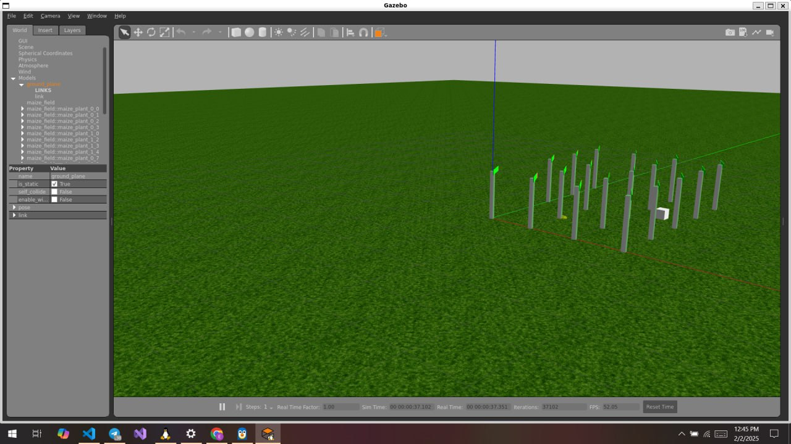

# Advanced Swarm Robotics for Precision Agriculture Monitoring

## Project Overview

This project focuses on utilizing **swarm robotics** to enhance precision agriculture, specifically targeting the **detection and management of wheat rust**. By simulating real-world agricultural environments using **Gazebo** and leveraging **ROS 2** for coordination, we aim to create an efficient and autonomous solution for crop health monitoring and intervention.

## Objectives

- **Detect Wheat Rust:** Deploy swarm robots to identify wheat rust in agricultural fields.
- **Analyze & Map Infestation:** Process data to map and prioritize affected areas.
- **Targeted Interventions:** Perform precise treatments where needed.
- **Realistic Simulation:** Test the entire system in a virtual environment using Gazebo.

## System Architecture

- **Detection Robots (2):** Navigate fields and identify wheat rust using an advanced detector model.
- **Intervention Robots (2):** Execute targeted treatments based on data analysis.
- **Communication Backbone:** Powered by **ROS 2** for real-time coordination and data sharing.

## Key Features

- **Field Navigation:** Autonomous movement and obstacle avoidance using `nav2 bringup`.
- **Wheat Rust Detection:** Integrated detection models for real-time identification.
- **Dynamic Mapping:** Infestation level visualization with real-time updates.
- **Targeted Treatment:** Precision-based interventions to minimize resource usage.

## Simulation Environment

- Built in **Gazebo** with:
  - A virtual wheat field featuring different infestation zones.
  - Color-coded indicators to represent varying rust severity levels.



## ROS 2 Integration

- **Navigation:** `nav2` for path planning and obstacle avoidance.
- **Communication:** ROS 2 topics for inter-robot data exchange.
- **Task Coordination:** Real-time decision-making and collision management.

## Running the Simulation

After sourcing your ROS 2 environment and downloading the necessary packages, you can run the simulation with the following command:

```bash
ros2 launch control_coordination general_launch.py
```

This command will launch the simulation environment in Gazebo, initializing all swarm robots for wheat rust detection, data analysis, and targeted intervention.

Make sure you have:

1. Installed all required dependencies.  
2. Sourced the ROS 2 environment:

   ```bash
   source /opt/ros/<distro>/setup.bash
   source install/setup.bash
   ```

   Replace `<distro>` with your ROS 2 distribution (e.g., `foxy`, `galactic`).

## Expected Outcomes

- High-accuracy wheat rust detection.
- Efficient resource allocation through infestation mapping.
- Successful simulation of intervention strategies.
- A practical demonstration of swarm robotics in agricultural applications.

## Challenges Encountered

- Docker configuration issues.
- Complexities in model integration.
- Fine-tuning of the simulated agricultural environment.


**Contributions and improvements are welcome!** Feel free to fork this repository, submit pull requests, or open issues to help enhance the system.